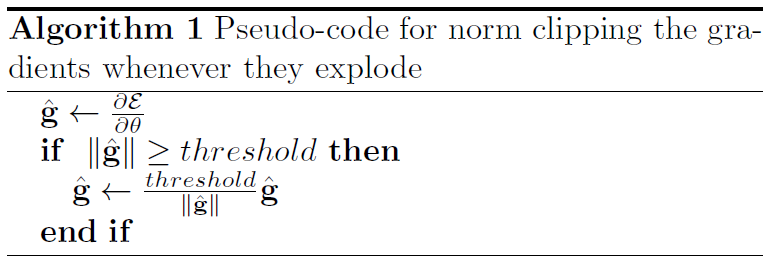

# 循环神经网络(RNN)知识入门

**原创**：方云

----

## 一. RNN的发展历史

1986年，Elman等人提出了用于处理序列数据的**循环神经网络(Recurrent Neural Networks)**。如同卷积神经网络专门用于处理二维数据信息（如图像）的神经网络，循环神经网络是专用于处理序列信息的神经网络。循环网络可以扩展到更长的序列，大多数循环神经网络可以处理可变长度的序列，循环神经网络的诞生解决了传统神经网络在处理序列信息方面的局限性。

1997年，Hochreiter和Schmidhuber提出了**长短时记忆单元（Long Short-Term Memory, LSTM）**用于解决标准循环神经网络时间维度的梯度消失问题(vanishing gradient problem)。标准的循环神经网络结构存储的上下文信息的范围有限，限制了RNN的应用。LSTM型RNN用LSTM单元替换标准结构中的神经元节点，LSTM单元使用输入门、输出门和遗忘门控制序列信息的传输，从而实现较大范围的上下文信息的保存与传输。

1998年，Williams和Zipser提出**BPTT(Backpropagation Through Time, 随时间反向传播)**的循环神经网络训练算法。BPTT算法的本质是按照时间序列将循环神经网络展开，展开后的网络包含N(时间步长)个隐含单元和一个输出单元，然后采用反向误差传播方式对神经网络的连接权值进行更新。

2001年，Gers和Schmidhuber提出了具有重大意义的LSTM型RNN优化模型，在传统的LSTM单元中加入了窥视孔连接(peephole connections)。具有窥视孔连接的LSTM型RNN模型是循环神经网络最流行的模型之一，窥视孔连接进一步提高了LSTM单元对具有长时间间隔相关性特点的序列信息的处理能力。2005年，Graves成功将LSTM型RNN应用于语音处理；2007年，Hochreiter将LSTM型RNN应用于生物信息学研究。

## 二. 什么是RNN？

RNN背后的想法是利用顺序信息。 在传统的神经网络中，我们假设所有输入（和输出）彼此独立。 但对于许多任务而言，这是一个非常糟糕的想法。 如果你想预测句子中的下一个单词，那你最好知道它前面有哪些单词。 RNN被称为*循环，*因为它们对序列的每个元素执行相同的任务，输出取决于先前的计算。 考虑RNN的另一种方式是它们有一个“记忆”，它可以捕获到目前为止计算的信息。 理论上，RNN可以利用任意长序列中的信息，但实际上它们仅限于回顾几个步骤（稍后将详细介绍）。 这是典型的RNN的样子：

展开的网络在t 时刻， $x_t$是输入，f是隐藏层激活函数，通常是非线性的，如tanh函数或ReLU函数；$s_t$是隐藏层的输出，其中$s_0$是计算第一个隐藏层所需要的，通常初始化为全零； g 是输出层激活函数，可以是softmax函数， $o_t$ 是输出层的输出。关键一点是，  $s_t$的值不仅取决于 $x_t$，还取决于$s_{t-1}$ 。循环神经网络的前向计算过程用公式表示如下：

$o_t=g(V \cdot s_t + b_2)$                         (1) 

$s_t=f(U \cdot x_t + W \cdot s_{t-1} + b_1)$    (2)

通过两个公式的循环迭代，有以下推导：

$o_t=g(V \cdot s_t + b_2)$ 

​     $=g(V \cdot f(U \cdot x_t+W \cdot s_{t-1}+b_1)+b_2)$

​     $=g(V \cdot f(U \cdot x_t+W \cdot f(U \cdot x_{t-1}+W \cdot s_{t-2}+b1)+b1)+b2) $

​     $=g(V \cdot f(U \cdot x_t+W \cdot f(U \cdot x_{t-1}+W \cdot f(U \cdot x_{t-2}+....)))+b2) $

可以看到，当前时刻包含了历史信息，这说明循环神经网络能够记忆历史信息。

这里有几点需要注意：

- 你可以看到隐藏的状态 $s_t$ 作为网络的记忆。   $s_t$ 捕获有关所有先前时间步骤中发生的事件的信息。 步骤输出 $o_t$ 仅根据时间$t$的记忆计算。 正如上面简要提到的，它在实践中有点复杂，因为 $s_t$ 通常无法从太多时间步骤中捕获信息。
- 与在每层使用不同参数的传统深度神经网络不同，RNN**共享相同的参数**(所有步骤的U,V,W)。 这反映了我们在每个步骤执行相同任务的事实，只是使用不同的输入。 这大大减少了我们需要学习的参数总数。
- 上图在每个时间步都有输出，但根据任务，这可能不是必需的。 例如，在预测句子的情绪时，我们可能只关心最终的输出，而不是每个单词之后的情绪。 同样，我们可能不需要在每个时间步骤输入。具体组合有：
- 编程术语中，RNN可以解释为运行具有某些输入和一些内部变量的固定程序。 从这个角度来看，RNN基本上描述了程序。 实际上，众所周知， RNN是Turing-Complete ，因为它们可以模拟任意程序（具有适当的权重）。

## 三. RNN能做什么？

RNN在NLP的许多任务上取得巨大成功。主要的应用领域有：

- 语言建模与生成文本（本文示例重点介绍）

  - 给定一系列单词，我们想要预测给定下一单词的概率
  - 能够预测下一个单词的副作用是我们得到一个生成模型，它允许我们通过从输出概率中抽样来生成新文本
  - 应用模式many to one

- 机器翻译

  - 机器翻译类似于语言建模，因为我们的输入是源语言中的一系列单词（例如德语）。 我们希望以目标语言输出一系列单词（例如英语）
  - 应用模式many to many

- 语音识别

  - 给定来自声波的声学信号的输入序列，我们可以预测一系列语音片段及其概率。
  - 应用模式many to many  

- 生成图像描述

  - 与卷积神经网络一起，RNN已被用作模型的一部分，以生成未标记图像的描述 。

  - 应用模式one to many

    

## 四. BPTT公式推导与RNN梯度消失问题

假设我们的时间序列只有三段，假设在t=3时刻，损失函数为 $L_{3}=\frac{1}{2}(Y_{3}-O_{3})^{2} $，

则对于一次训练任务的损失函数为 $L=\sum_{t=1}^{T}{L_{t}}$ ，即每一时刻损失值的累加。

使用随机梯度下降法训练RNN其实就是对 $W_{x}​$ 、 $W_{s}​$ 、 $W_{o}​$ 以及 $b_{1}​$、$b_{2}​$ 求偏导，并不断调整它们以使L尽可能达到最小的过程。(注意此处把上文中的UVW参数替换为 $W_{x}​$ 、 $W_{s}​$ 、 $W_{o}​$，以保持和引用的文章一致。)

现在假设我们我们的时间序列只有三段，t1，t2，t3。

我们只对t3时刻的 $W_{x}$、$W_{s}$、$W_{0}$ 求偏导（其他时刻类似）：

$\frac{\partial{L_{3}}}{\partial{W_{0}}}=\frac{\partial{L_{3}}}{\partial{O_{3}}}\frac{\partial{O_{3}}}{\partial{W_{o}}}$

$\frac{\partial{L_{3}}}{\partial{W_{x}}}=\frac{\partial{L_{3}}}{\partial{O_{3}}}\frac{\partial{O_{3}}}{\partial{S_{3}}}\frac{\partial{S_{3}}}{\partial{W_{x}}}+\frac{\partial{L_{3}}}{\partial{O_{3}}}\frac{\partial{O_{3}}}{\partial{S_{3}}}\frac{\partial{S_{3}}}{\partial{S_{2}}}\frac{\partial{S_{2}}}{\partial{W_{x}}}+\frac{\partial{L_{3}}}{\partial{O_{3}}}\frac{\partial{O_{3}}}{\partial{S_{3}}}\frac{\partial{S_{3}}}{\partial{S_{2}}}\frac{\partial{S_{2}}}{\partial{S_{1}}}\frac{\partial{S_{1}}}{\partial{W_{x}}}$

$\frac{\partial{L_{3}}}{\partial{W_{s}}}=\frac{\partial{L_{3}}}{\partial{O_{3}}}\frac{\partial{O_{3}}}{\partial{S_{3}}}\frac{\partial{S_{3}}}{\partial{W_{s}}}+\frac{\partial{L_{3}}}{\partial{O_{3}}}\frac{\partial{O_{3}}}{\partial{S_{3}}}\frac{\partial{S_{3}}}{\partial{S_{2}}}\frac{\partial{S_{2}}}{\partial{W_{s}}}+\frac{\partial{L_{3}}}{\partial{O_{3}}}\frac{\partial{O_{3}}}{\partial{S_{3}}}\frac{\partial{S_{3}}}{\partial{S_{2}}}\frac{\partial{S_{2}}}{\partial{S_{1}}}\frac{\partial{S_{1}}}{\partial{W_{s}}}$

可以看出对于 $W_{0}$ 求偏导并没有长期依赖，但是对于 $W_{x}$、$W_{s}$ 求偏导，会随着时间序列产生长期依赖。因为 $S_{t}$ 随着时间序列向前传播，而 $S_{t}$ 又是 $W_{x}$、$W_{s}$的函数。

根据上述求偏导的过程，我们可以得出任意时刻对 $W_{x}$、$W_{s}$ 求偏导的公式：

$\frac{\partial{L_{t}}}{\partial{W_{x}}}=\sum_{k=0}^{t}{\frac{\partial{L_{t}}}{\partial{O_{t}}}\frac{\partial{O_{t}}}{\partial{S_{t}}}}(\prod_{j=k+1}^{t}{\frac{\partial{S_{j}}}{\partial{S_{j-1}}}})\frac{\partial{S_{k}}}{\partial{W_{x}}}$

任意时刻对$W_{s}$ 求偏导的公式同上。

如果加上激活函数， $S_{j}=tanh(W_{x}X_{j}+W_{s}S_{j-1}+b_{1})$ ，

则 $\prod_{j=k+1}^{t}{\frac{\partial{S_{j}}}{\partial{S_{j-1}}}} = \prod_{j=k+1}^{t}{tanh^{'}}W_{s}$

激活函数tanh和它的导数图像如下。

由上图可以看出 $tanh^{'}\leq1$ ，对于训练过程大部分情况下tanh的导数是小于1的，因为很少情况下会出现$W_{x}X_{j}+W_{s}S_{j-1}+b_{1}=0$ ，如果 $W_{s}$ 也是一个大于0小于1的值，则当t很大时 $\prod_{j=k+1}^{t}{tanh^{'}}W_{s}$ ，就会趋近于0，和 $0.01^{50}$ 趋近与0是一个道理。同理当 $W_{s}$ 很大时 $\prod_{j=k+1}^{t}{tanh^{'}}W_{s} $就会趋近于无穷，这就是RNN中梯度消失和爆炸的原因。

梯度消失是怎样现象？例如在RNN的语言模型中，在预测下一个单词时，没有考虑过去许多时间步的信息。 如下面句子：

Jane walked into the room. John walked in too. It was late in the day. Jane said hi to ____

为什么梯度消失是个问题？简单说，当我们看到$\prod_{j=k+1}^{t}{\frac{\partial{S_{j}}}{\partial{S_{j-1}}}} $趋近于0时，我们不能判断:

1. 是时刻t和t+n之间没有依赖关系？
2. 还是参数的错误配置导致的？

对于梯度爆炸，Mikolov首先提出的解决方案是裁剪梯度，使它们的范数具有一定的最大值。

至于怎么避免这些现象，再看看 $\frac{\partial{L_{t}}}{\partial{W_{x}}}=\sum_{k=0}^{t}{\frac{\partial{L_{t}}}{\partial{O_{t}}}\frac{\partial{O_{t}}}{\partial{S_{t}}}}(\prod_{j=k+1}^{t}{\frac{\partial{S_{j}}}{\partial{S_{j-1}}}})\frac{\partial{S_{k}}}{\partial{W_{x}}} $梯度消失和爆炸的根本原因就是 $\prod_{j=k+1}^{t}{\frac{\partial{S_{j}}}{\partial{S_{j-1}}}} $这一部分，要消除这种情况就需要把这一部分在求偏导的过程中去掉，至于怎么去掉，一种办法就是使 ${\frac{\partial{S_{j}}}{\partial{S_{j-1}}}}\approx1 $另一种办法就是使 ${\frac{\partial{S_{j}}}{\partial{S_{j-1}}}}\approx0 $。其实这就是LSTM做的事情.

## 五. LSTM与GRU

长短期记忆(LSTM)模型来解决稳定性和梯度消失的问题。在这个模型中，常规的神经元被存储单元代替，每个存储单元由输入门、输出门、自有状态组成。存储单元中管理向单元移除或添加的结构叫门限，有三种：遗忘门、输入门、输出门，门限由$sigmoid$ 激活函数和逐点乘法运算组成。前一个时间步长的隐藏状态被送到遗忘门、输入门和输出门。在前向计算过程中，输入门学习何时激活让当前输入传入存储单元，而输出门学习何时激活让当前隐藏层状态传出存储单元。单个LSTM 神经元的具体结构如图所示：

我们假设h 为LSTM 单元的隐藏层输出，c 为LSTM 内存单元的值，x 为输入数据。LSTM 单元的更新与前向传播一样，可以分为以下几个步骤。

1. 首先，我们先计算当前时刻的输入结点$g_{(t)}$，$W_{xg}$，$W_{hg}$，$W_{cg}$ 分别是输入数据和上一时刻LSTM 单元输出的权值：
   1. $\alpha^t_g=W_{xg}^Tx_{(t)}+W_{hg}^Th_{(t-1)}+b_g$
   2. $g_{(t)}=tanh(\alpha^t_g) $
2. 计算输入门 (inputgate) 的值 $i_{(t)}$。输入门用来控制当前输入数据对记忆单元状态值的影响。所有门的计算受当前输入数据$x_{(t)}$和上一时刻LSTM 单元输出值$h_{(t-1)}$影响。注意，由Gers和Schmidhuber引入的一种流行的LSTM变体是添加“窥视孔连接”。这意味着我们能看到单元状态。
   1. $\alpha^t_i=W_{xi}^Tx_{(t)}+W_{hi}^Th_{(t-1)}+b_i$
   2. $i_{t}=\sigma(\alpha^t_i)$
3. 计算遗忘门的值$f_{(t)}$。遗忘门主要用来控制历史信息对当前记忆单元状态值的影响，为记忆单元提供了重置的方式。
   1. $\alpha^t_f=W_{xf}^Tx_{(t)}+W_{hf}^Th_{(t-1)}+b_f$
   2. $f_{t}=\sigma(\alpha^t_f)$
4. 计算当前时刻记忆单元的状态值$c_{(t)}$。记忆单元是整个LSTM 神经元的核心结点。记忆单元的状态更新主要由自身状态$c_{(t-1)}$和当前时刻的输入结点的值$g_{(t)}$，并且利用乘法门通过输入门和遗忘门分别对这两部分因素进行调节。乘法门的目的是使 LSTM 存储单元存储和访问时间较长的信息，从而减轻消失的梯度。
   1. $c_{(t)}=f_{(t)} \otimes c_{(t-1)}+i_{(t)} \otimes  g_{(t)}$
5. 计算输出门$o_{(t)}$。输出门用来控制记忆单元状态值的输出。
   1. $\alpha^t_o=W_{xo}^Tx_{(t)}+W_{ho}^Th_{(t-1)}+b_o$
   2. $o_{t}=\sigma(\alpha^t_o)$
6. 最后计算LSTM 单元的输出。
   1. $h_{(t)}=o_{(t)} \otimes tanh(c_{(t)})$

由Gers和Schmidhuber在2000年引入的一种流行的LSTM变体是添加“窥视孔连接”。这意味着下面情况的改变。

LSTM稍微有点戏剧性的变化是由Cho等人引入的门控循环单元（GRU）  。 它将遗忘和输入门组合成一个“更新门”。它还合并了单元状态和隐藏状态，并进行了一些其他更改。 由此产生的模型比标准LSTM模型简单，并且越来越受欢迎。

## 六. LSTM如何解决解决梯度消失问题？

LSTM可以抽象成这样:

三个×分别代表的就是forget gate，input gate，output gate，而我认为LSTM最关键的就是forget gate这个部件。这三个gate是如何控制流入流出的呢，其实就是通过下面 $f_{t}$,$i_{t}$,$o_{t}$ 三个函数来控制，因为 $\sigma(x)$（代表sigmoid函数） 的值是介于0到1之间的，刚好用趋近于0时表示流入不能通过gate，趋近于1时表示流入可以通过gate。

$f_{t}=\sigma({W_{f}X_{t}}+b_{f})$

$i_{t}=\sigma({W_{i}X_{t}}+b_{i})$

 $o_{i}=\sigma({W_{o}X_{t}}+b_{o})$

当前的状态 $S_{t}=f_{t}S_{t-1}+i_{t}X_{t}$, 将LSTM的状态表达式展开后得：

$S_{t}=\sigma(W_{f}X_{t}+b_{f})S_{t-1}+\sigma(W_{i}X_{t}+b_{i})X_{t}$

如果加上激活函数， $S_{t}=tanh\left[\sigma(W_{f}X_{t}+b_{f})S_{t-1}+\sigma(W_{i}X_{t}+b_{i})X_{t}\right]$

传统RNN求偏导的过程包含 $\prod_{j=k+1}^{t}\frac{\partial{S_{j}}}{\partial{S_{j-1}}}=\prod_{j=k+1}^{t}{tanh{'}W_{s}}$

对于LSTM同样也包含这样的一项，但是在LSTM中 $\prod_{j=k+1}^{t}\frac{\partial{S_{j}}}{\partial{S_{j-1}}}=\prod_{j=k+1}^{t}{tanh{’}\sigma({W_{f}X_{t}+b_{f}})}$

假设 $Z=tanh{'}(x)\sigma({y})$ ，则 Z  的函数图像如下图所示：

可以看到该函数值基本上不是0就是1。再看RNN求偏导过程中有：

$\frac{\partial{L_{3}}}{\partial{W_{s}}}=\frac{\partial{L_{3}}}{\partial{O_{3}}}\frac{\partial{O_{3}}}{\partial{S_{3}}}\frac{\partial{S_{3}}}{\partial{W_{s}}}+\frac{\partial{L_{3}}}{\partial{O_{3}}}\frac{\partial{O_{3}}}{\partial{S_{3}}}\frac{\partial{S_{3}}}{\partial{S_{2}}}\frac{\partial{S_{2}}}{\partial{W_{s}}}+\frac{\partial{L_{3}}}{\partial{O_{3}}}\frac{\partial{O_{3}}}{\partial{S_{3}}}\frac{\partial{S_{3}}}{\partial{S_{2}}}\frac{\partial{S_{2}}}{\partial{S_{1}}}\frac{\partial{S_{1}}}{\partial{W_{s}}}$

,如果在LSTM中的$\frac{\partial{L_{3}}}{\partial{W_{s}}}$可能就会变成：

$\frac{\partial{L_{3}}}{\partial{W_{s}}}=\frac{\partial{L_{3}}}{\partial{O_{3}}}\frac{\partial{O_{3}}}{\partial{S_{3}}}\frac{\partial{S_{3}}}{\partial{W_{s}}}+\frac{\partial{L_{3}}}{\partial{O_{3}}}\frac{\partial{O_{3}}}{\partial{S_{3}}}\frac{\partial{S_{2}}}{\partial{W_{s}}}+\frac{\partial{L_{3}}}{\partial{O_{3}}}\frac{\partial{O_{3}}}{\partial{S_{3}}}\frac{\partial{S_{1}}}{\partial{W_{s}}}$

这是因为： $\prod_{j=k+1}^{t}\frac{\partial{S_{j}}}{\partial{S_{j-1}}}=\prod_{j=k+1}^{t}{tanh{’}\sigma({W_{f}X_{t}+b_{f}})}\approx0|1 $，这样就解决了传统RNN中梯度消失的问题。

## 七. RNN实战示例

###  **a. 语言建模**

**语言建模(Language Modeling)**, 通常指实现预测下一个单词的任务。例如下图，输入了"the students opened their"这个未完成的句子，预测下个单词最有可能的是哪一个？

更为**形式的描述**为：给定一个单词序列, $x^{(1)},x^{(2)},...,x^{(t)}$，计算下一个单词$x^{t+1}$的概率分布：

$P(x^{t+1}=w_j|x^{(t)},...,x^{(1)})$

这里$w_j$是在词汇表$V=\{w_1,...,w_{|V|}\}$任一单词. 

或者从句子的角度看，我们预测观察句子（在给定数据集中）的概率为：

$P(w_1,...,w_m) = \prod_{i=1}^{m} P(w_i \mid w_1,..., w_{i-1})$

对语言来说，句子的概率是每个单词概率的乘积。 因此，判断“他去买一些巧克力”这句话的可能性是“巧克力”在给出“他去买一些”的概率，乘以“他去买”的在“某些”的概率，依次等等。

### **b. 语言建模的应用**

日常生活中天天会用到这个模型。例如在手机输入法中：

在Google搜索框中：

### c. n-gram语言模型

* 问：怎样学习一个语言模型？
* 答：（深度学习前）：使用n-gram语言模型
* 定义：n-gram是由n个连续单词组成的块。
  * **uni**grams: “the”, “students”, “opened”, ”their”
  * **bi**grams: “the students”, “students opened”, “opened their”
  * **tri**grams: “the students opened”, “students opened their”
  * **4-**grams: “the students opened their”
* 思想：收集关于不同n-grams频率的统计信息，用这些来预测下一个单词。
* 具体实现参考文献[3]

### d. RNN语言模型源代码

参考： https://github.com/dennybritz/rnn-tutorial-rnnlm

其中有：https://github.com/dennybritz/rnn-tutorial-rnnlm/blob/master/RNNLM.ipynb 可以演示具体的运行过程。

## 八. 参考文献

1. [The Unreasonable Effectiveness of Recurrent Neural Networks](http://karpathy.github.io/2015/05/21/rnn-effectiveness/)
2. [Recurrent Neural Networks Tutorial, Part 1 – Introduction to RNNs](http://www.wildml.com/2015/09/recurrent-neural-networks-tutorial-part-1-introduction-to-rnns/)
3. [Recurrent Neural Networks Tutorial, Part 2 – Implementing a RNN with Python, Numpy and Theano](http://www.wildml.com/2015/09/recurrent-neural-networks-tutorial-part-2-implementing-a-language-model-rnn-with-python-numpy-and-theano/)
4. [Recurrent Neural Networks Tutorial, Part 3 – Backpropagation Through Time and Vanishing Gradients](http://www.wildml.com/2015/10/recurrent-neural-networks-tutorial-part-3-backpropagation-through-time-and-vanishing-gradients/)
5. [Recurrent Neural Networks and Language Models ](http://web.stanford.edu/class/cs224n/lectures/lecture8.pdf)
6. [On the difficulty of training recurrent neural networks](http://proceedings.mlr.press/v28/pascanu13.pdf)
7. [Understanding LSTM Networks](http://colah.github.io/posts/2015-08-Understanding-LSTMs/)
8. 张尧. 激活函数导向的RNN算法优化[D].浙江大学,2017.
9. 高茂庭,徐彬源.基于循环神经网络的推荐算法[J/OL].计算机工程:1-7[2018-11-30]
10. 成烯，钟波. 基于LSTM神经网络的股价短期预测模型[EB/OL]. 北京：中国科技论文在线 [2018-04-04]. 
11. [Text generation using a RNN with eager execution](https://www.tensorflow.org/tutorials/sequences/text_generation)
12. [新型RNN——将层内神经元相互独立以提高长程记忆](http://www.paperweekly.site/papers/notes/350)
13. [RNN梯度消失和爆炸的原因](https://zhuanlan.zhihu.com/p/28687529)
14. [LSTM如何解决梯度消失问题](https://zhuanlan.zhihu.com/p/28749444)